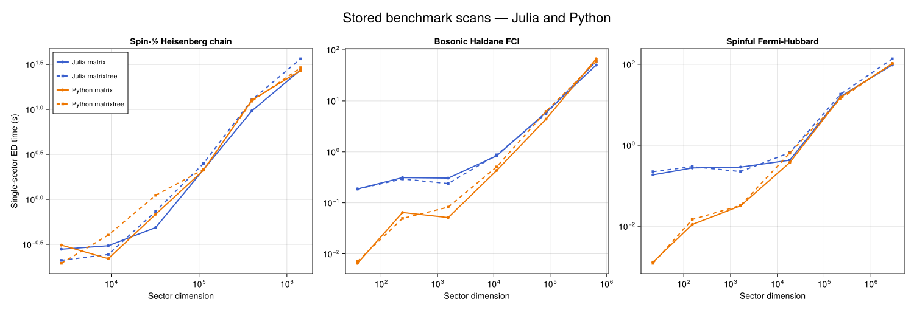
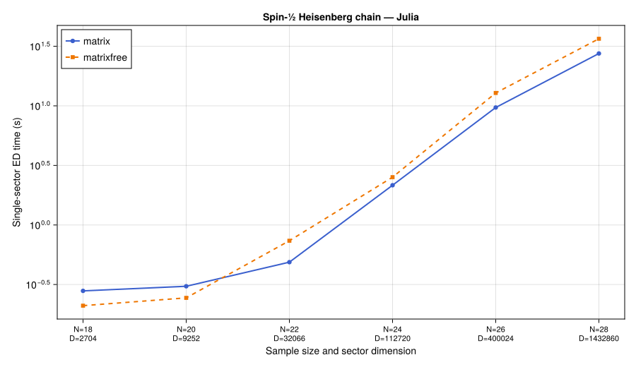
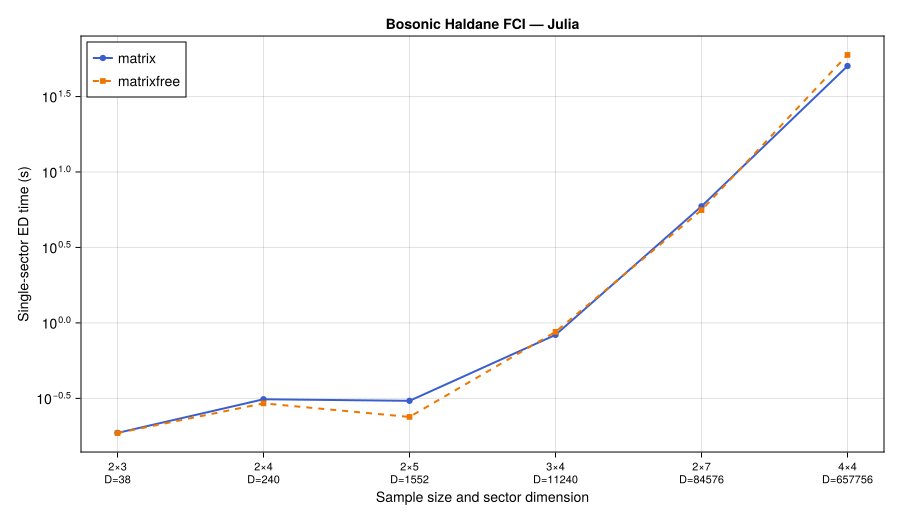
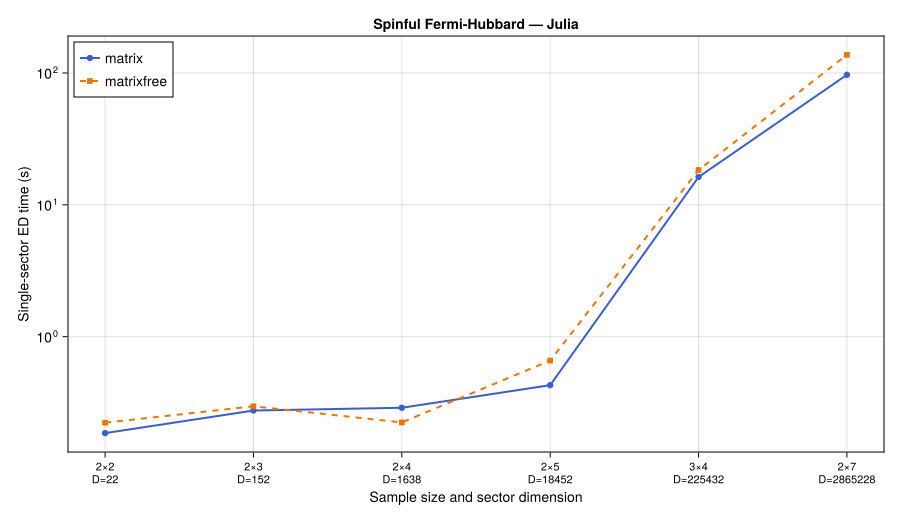

# Package `RealSpace_ExactDiagonalization.jl`
--- Symmetry-resolved exact diagonalization on _arbitrary_ real-space graphs, **supporting both spin/bosonic and fermionic systems with arbitrary spins or other internal degrees of freedom**.

A high-performance, statistics-agnostic Julia implementation similar to the design philosophy of [XDiag](https://github.com/awietek/xdiag). The package block-diagonalizes interacting quantum lattice Hamiltonians via bitmask encoding, orbit-stabilizer decomposition, and irrep-induced projection, with or without forming the full many-body matrix.

---

## Table of Contents

- [Design Innovations](#design-innovations)
- [Architecture](#architecture)
- [Theoretical Background](#theoretical-background)
- [⚠️ Understanding `filling_fraction`](#⚠️-understanding-filling_fraction)
- [Quick Start](#quick-start)
- [Examples](#examples)
- [Many-Body Topological Observables](#many-body-topological-observables)
- [Benchmarks](#benchmarks)
- [File Structure](#file-structure)
- [Dependencies](#dependencies)
- [References](#references)

---

## Design Innovations

1. **Bitmask encoding** — every Fock configuration $|n_1,\ldots,n_N\rangle$ (hard-core, $n_i\in\{0,1\}$) is a single `UInt` integer $m = \sum_i n_i 2^{i-1}$, enabling $O(1)$ bitwise operations via single-cycle CPU instructions (`popcount`, `ctz`, bitwise AND/OR/XOR).

2. **Orbit-stabilizer decomposition** — the many-body Hilbert space is partitioned into orbits under the symmetry group $G$. Each orbit is labelled by a canonical representative $|[\mathbf{s}]\rangle$ and its stabilizer subgroup data. Only representatives are stored, achieving the optimal $|G|$-fold compression.

3. **Irrep-induced projection** — 1D irreducible representations of finite abelian groups supply projectors $P_\chi$ that block-diagonalize the Hamiltonian without ever constructing the full matrix. An orbit contributes to irrep $\chi$ iff its stabilizer phases satisfy a compatibility condition.

4. **Two computational modes, one representative table** — a *matrix mode* that precomputes sparse CSC matrices for fast Arpack diagonalization (memory-intensive but fast), and a *matrix-free mode* that computes $H|\psi\rangle$ on-the-fly from a precomputed projection table (row–column–amplitude triplets) via multithreaded gather–scatter kernels. Both modes obtain O(1) canonical-representative lookups from **XDiag-style representative tables**: dense per-state arrays over the full basis (representative index, group element, amplitude), indexed by the combinadic rank — 24 bytes per basis state for the three representative arrays, with no visited-state `Set` or canonicalization `Dict`.

5. **Unified boson/fermion treatment** — the entire pipeline is statistics-agnostic. Fermionic signs (permutation parity in symmetry actions and Jordan-Wigner strings in hopping) are injected via compile-time multiple dispatch on `Bosonic()` / `Fermionic()` singleton types, with zero runtime branching overhead.

6. **Twisted boundary conditions and spectral flow** — gauge-covariant translations preserve momentum labels at nonzero flux. Scans construct the flux-dependent basis and solve every momentum sector at each twist. Pump and Chern calculations reselect the globally lowest manifold and check its isolation.

---

## Architecture

```
                           ┌──────────────────────────────────────┐
                           │  Real_Space_Second_Quantized_Model   |
                           │  · lattice geometry                  │
                           │  · bilinear terms  (a†_i a_j)        │
                           │  · density terms   (n_i n_j)         │
                           │  · particle_statistics      (Bosonic/Fermionic)│
                           └──────────────┬───────────────────────┘
                                          │
              ┌───────────────────────────┼───────────────────────────┐
              │                           │                           │
    ┌─────────▼───────────┐    ┌───────────▼──────────┐    ┌──────────▼────────────┐
    │  Symmetry_Operation │    │  Gosper's Hack       │    │  Bitwise_Operations   │
    │  · perm:  π_g(i)    │    │  enumerate fixed-    │    │  · occupy/empty       │
    │  · phase: η_g(i)    │    │  weight bitmasks     │    │  · count_ones (popcnt)│
    │  · label g ∈ G      │    │  in lexicographic    │    │  · trailing_zeros     │
    └─────────┬───────────┘    │  order, O(1)/iter,   │    └───────────────────────┘
              │                │  zero allocation     │
              │                └───────────┬──────────┘
              │                           │
    ┌─────────▼──────────┐    ┌───────────▼───────────┐
    │  Finite_Symmetry_   │    │  Symmetry_Orbit_      │
    │  Group              │    │  Catalog              │
    │  · |G| ordered ops  │    │  · representative_mask │
    │  · identity index   │    │  · stabilizer orders   │
    └─────────┬──────────┘    │  · stabilizer phases    │
              │               └───────────┬───────────┘
              │                           │
              │               ┌───────────▼───────────┐
              │               │  OneDim_Irrep χ       │
              │               │  · label (e.g. k₁,k₂) │
              │               │  · χ(g₁), …, χ(g_|G|) │
              │               └───────────┬───────────┘
              │                           │
              │               ┌───────────▼───────────┐
              └───────────────┤  Symmetry_Sector_     │
                              │  Basis                │
                              │  · χ-compatible orbits │
                              │  · repr → index dict   │
                              └───────────┬───────────┘
                                          │
                         ┌────────────────┴────────────────┐
                         │                                 │
              ┌──────────▼──────────┐          ┌───────────▼──────────┐
              │  Matrix Mode         │          │  Matrix-Free Mode     │
              │                     │          │                      │
              │  representative      │          │  representative       │
              │  build sparse CSC   │          │  projection table    │
              │    ↓                │          │  Threads.@threads H|ψ⟩│
              │  Arpack eigs        │          │  KrylovKit eigsolve  │
              │                     │          │                      │
              │  Sparse CSC storage │          │  Projection triplets │
              │  + solver workspace │          │  + solver workspace  │
              │                     │          │                      │
              │  Parallel:          │          │  Parallel:           │
              │   Threads.@threads  │          │   Threads.@threads   │
              │   BLAS multi-thread │          │   per-thread buffers │
              └─────────────────────┘          └──────────────────────┘
```

### Pipeline

1. **Define model** — construct the lattice (via `TightBinding`), add hopping and interaction terms with particle statistics.
2. **Build symmetry group** — generate `Symmetry_Operation`s (permutations + U(1) phases) and their 1D irreps.
3. **Enumerate configurations** — Gosper's hack iterates all bitmasks at fixed particle number in lexicographic order.
4. **Orbit-stabilizer decomposition** — partition bitmasks into $G$-orbits; record canonical representatives and stabilizer phases.
5. **Filter by irrep** — for a given character $\chi$, keep only orbits satisfying $\chi(h) = \alpha_h([\mathbf{s}])$ for all $h\in\mathrm{Stab}$.
6. **Build Hamiltonian block** — construct the sparse CSC matrix or the matrix-free projection table using the shared representative lookups.
7. **Diagonalize** — Arpack (CSC) or KrylovKit (matrix-free) to obtain eigenvalues and eigenvectors.
8. **Post-process** — analyse spectra, compute correlators, checkpoint and resume.

### Parallelism Strategy (multithreading-only)

```
BLAS threads:  1 (default)
CanonicalMap:  read-only representative-table lookups in both modes
Build H:       Threads.@threads (shared-memory)
Diag:          BLAS.set_num_threads(nthreads()) temporarily for Arpack/KrylovKit
               … then restore BLAS = 1
Matvec H|ψ⟩:   Threads.@threads :static with per-thread accumulation buffers
GC:            explicit GC.gc(true) after each sector
Checkpoint:    JLD2 serialization of Symmetry_Resolved_ED_Data
```

---

## Theoretical Background

### Bitmask Encoding

With the hard-core constraint $n_i \in \{0,1\}$, each configuration is a binary string of length $N$:

$$\boxed{|\mathbf{s}\rangle \equiv |n_1,\ldots,n_N\rangle \;\longmapsto\; m = \sum_{i=1}^N n_i\,2^{\,i-1} \;\in\; \{0,1,\ldots,2^N-1\}}$$

Bit $i-1$ (0-based) corresponds to vertex $i$ (1-based). Key advantages:
- Occupancy test, creation, annihilation — all $O(1)$ bitwise operations.
- Lexicographic total order via integer comparison — natural for orbit representatives.
- `count_ones` (POPCNT), `trailing_zeros` (TZCNT), `&`, `|`, `^` — all single-cycle CPU instructions.

### Symmetry Action

For a finite group $G$ with unitary representation $U_g$ commuting with $H$:

$$U_g\,a_i^\dagger\,U_g^{-1} = \eta_g(i)\,a_{\pi_g(i)}^\dagger$$

On a bitmask $m$:

$$U_g|m\rangle = \alpha_g(m)\,|m'\rangle,\qquad m' = \sum_{i\in\mathrm{occ}(m)} 2^{\pi_g(i)-1},\qquad \alpha_g(m) = \prod_{i\in\mathrm{occ}(m)}\eta_g(i)$$

Fermionic statistics add a permutation parity factor: $\mathrm{sgn}(\pi_g|_{\mathrm{occ}(m)})$ computed inline via `count_ones(new_mask >> (π_g(i)-1))` during the bit-loop.

### Orbit-Stabilizer Theorem

$$|\mathrm{Orb}(\mathbf{s})| = \frac{|G|}{|\mathrm{Stab}(\mathbf{s})|}$$

The canonical representative is the smallest bitmask in the orbit (lexicographic gauge). Knowing only the $N_\text{orbits}$ representatives and their stabilizer data suffices to reconstruct the full Hilbert space, with compression ratio $\approx N_\text{orbits}/\binom{N}{N_e} \approx 1/|G|$.

### Irrep Projector and Compatibility

For a 1D irrep $\chi$ of a finite abelian group:

$$P_\chi = \frac{1}{|G|}\sum_{g\in G} \chi(g)^*\,U_g,\qquad P_\chi^2 = P_\chi,\qquad [P_\chi, H] = 0$$

An orbit representative $|[\mathbf{s}]\rangle$ contributes to sector $\chi$ iff:

$$\boxed{\chi(h) = \alpha_h([\mathbf{s}])\;\;\forall h\in\mathrm{Stab}(\mathbf{s})}$$

When compatible, the orthonormal projected basis state is:

$$|\widetilde{[\mathbf{s}];\chi}\rangle = \sqrt{\frac{|\mathrm{Stab}(\mathbf{s})|}{|G|}}\sum_{g\in G/\mathrm{Stab}(\mathbf{s})} \chi(g)^*\,U_g|[\mathbf{s}]\rangle$$

### Hamiltonian Matrix Elements

For a scattered configuration $|\mathbf{m}\rangle = H|[\mathbf{s}]\rangle$, projected back to the sector:

$$H_{\mathbf{s}',\mathbf{s}}^\chi = \mathsf{coeff}\cdot\sqrt{\frac{|\mathrm{Stab}(\mathbf{m})|}{|\mathrm{Stab}(\mathbf{s})|}}\;\delta_{[\mathbf{s}'],[\mathbf{m}]}$$

where $\mathsf{coeff} = \alpha_{g_{\mathbf{m}}}\,\chi(g_{\mathbf{m}})^*$ and $g_{\mathbf{m}}$ maps $|\mathbf{m}\rangle$ to its canonical representative.

### Jordan-Wigner String (Fermions)

The hopping sign for fermions depends only on occupied sites strictly between $i$ and $j$:

$$c_j^\dagger c_i\,|\mathbf{s}\rangle = (-1)^{\sum_{k=\min(i,j)+1}^{\max(i,j)-1} n_k}\;|\mathbf{s}; i \to j\rangle$$

Computed in $O(1)$ via `count_ones(m & between_mask)`.

---

## ⚠️ Important: Understanding `filling_fraction`

The keyword `filling_fraction` in `build_ed_data` means **particle number per _flattened_ graph vertex**, i.e. `n_filled / n_total_vertices`. This is NOT the same as the "filling per band" used in many condensed-matter communities. The two conventions differ:

| Community / Model | What they call "filling" | `filling_fraction` in this code |
|---|---|---|
| **Spinful Hubbard** (2×Lx×Ly vertices) | "half-filling" = 1 electron per spatial site | `filling_fraction = 1//2` (N_e = Lx·Ly out of 2·Lx·Ly) |
| **FCI / bosonic Hubbard** (2×Lx×Ly vertices) | "ν = 1/2 per band" = 1/4 of all graph sites | `filling_fraction = 1//4` (e.g. 3//12 for 2×3) |
| **Spinless fermions** (Lx×Ly vertices) | "half-filling" = N/2 particles | `filling_fraction = 1//2` |
| **Spin-½ Heisenberg chain** (N vertices) | "half-filling" = N/2 bosons | `filling_fraction = 1//2` |

> **Rule of thumb**: Always compute `filling_fraction = N_particles / N_total_graph_vertices`. Count ALL internal degrees of freedom (spin, sublattice, band, etc.) as separate graph vertices.

---

## Quick Start

```julia
using RealSpace_ExactDiagonalization
using TightBinding

# ── Build the Haldane honeycomb model (2×3 unit cells, 3 hard-core bosons) ──
# Step 1: real-space lattice
r_data = TightBinding.initialize_real_space_lattice(;
    sample_size=[2, 3],
    brav_vec_list=[[1.0, 0.0], [1/2, sqrt(3)/2]],
    sub_crys_list=[[0.0, 0.0], [1/3, 1/3]],
    lattice_name="Haldane_Honeycomb", pbc_indicator=[true, true])
lattice = r_data

# Step 2: tight-binding model with hoppings
tb = TightBinding.initialize_real_space_tightbinding_model(lattice; model_name="haldane")
t, t′, t′′, ϕ = 1.0, 0.60, -0.58, 0.2
add_hopping_term!(tb, (([0,0],1),([0,0],2)) => -t; is_hermitian=true)
add_hopping_term!(tb, (([0,0],1),([0,-1],2)) => -t; is_hermitian=true)
add_hopping_term!(tb, (([0,0],1),([-1,0],2)) => -t; is_hermitian=true)
# ... (see examples/boson_fci_haldane.jl for full set)

# Step 3: assemble second-quantized model
bilinear_terms = [(lattice.site_to_index_map[sf], lattice.site_to_index_map[st], ComplexF64(t))
                  for ((sf,st),t) in tb.full_hopping_map]
second_quantized_model = Real_Space_Second_Quantized_Model(
    Dict("t"=>t), lattice, tb, Bosonic(), bilinear_terms, Tuple{Int,Int,ComplexF64}[])

# ── Translation symmetry: |G| = 6 ──
symmetry = build_translation_group(lattice)

# ── Build ED data: 3 bosons / 12 graph vertices = filling_fraction 3//12 ──
#    (⚠️ NOT ν=1/2 per band — that would be 6 bosons!)
ed_data = build_ed_data(second_quantized_model; filling_fraction=3//12, symmetry_group=symmetry)

# ── Scan all momentum sectors (matrix-free, 8 threads) ──
ed_scan!(ed_data; nev=5, mode=:matrixfree)

# ── Inspect ──
print_spectrum(ed_data)
fig, ax = plot_spectrum(ed_data)
save("spectrum.svg", fig)
```

### Checkpoint-Resume (HPC-safe)

```julia
# Run with checkpoint — survives preemption
ed_scan!(ed_data; mode=:matrixfree, checkpoint_path="checkpoints/run1.jls")

# Resume — already-computed sectors are automatically skipped
ed_data = load_checkpoint("checkpoints/run1.jls")
ed_scan!(ed_data; mode=:matrixfree, checkpoint_path="checkpoints/run1.jls")
```

---

## Examples

Three self-contained, pedagogical example scripts in `examples/`. Each builds a lattice via `TightBinding`, constructs the second-quantized model, sets up translation symmetry, and runs symmetry-resolved ED.

### 1. Spin-½ Heisenberg Chain — `examples/spin_heisenberg_chain.jl`

$$H = J\sum_{\langle i,j\rangle} \mathbf{S}_i\cdot\mathbf{S}_j \qquad (\text{1D chain, PBC, } J>0)$$

Mapped to hard-core bosons via the **Matsubara-Matsuda** transformation:

$$S^z_i = n_i - \tfrac12,\qquad S^+_i = b^\dagger_i,\qquad S^-_i = b_i$$

$$\mathbf{S}_i\cdot\mathbf{S}_j = n_i n_j + \tfrac12(b^\dagger_i b_j + \mathrm{h.c.}) - \tfrac12 n_i - \tfrac12 n_j + \tfrac14$$

At half-filling ($N_e=N/2$), constant contributions sum to $-JN/4$ and are absorbed by on-site density terms $(i,i,-J/2)$. Translation symmetry $\mathbb Z^N$ gives $N$ momentum sectors.

```bash
julia --project=. examples/spin_heisenberg_chain.jl
```

**Benchmark:** $E_0/N = -\ln 2 + 1/4 \approx -0.443147$ (Bethe ansatz, thermodynamic limit).

### 2. Bosonic Fractional Chern Insulator — `examples/boson_fci_haldane.jl`

$$H = \sum_{\langle i,j\rangle} t_{ij}\,b^\dagger_i b_j + \sum_{\langle\langle i,j\rangle\rangle} t'_{ij}\,b^\dagger_i b_j + \sum_{\langle\langle\langle i,j\rangle\rangle\rangle} t''_{ij}\,b^\dagger_i b_j$$

Haldane honeycomb lattice, 2×3 unit cells (12 sites), 3 hard-core bosons at $\nu=1/2$ per band. Complex next-nearest-neighbour hoppings $t' = -0.60\,e^{\pm i\phi}$ ($\phi=0.4\pi$) break time-reversal symmetry. Parameters from D.N. Sheng et al., PRL **107**, 146803 (2011).

```bash
julia --project=. examples/boson_fci_haldane.jl
```

**Expected:** Two nearly degenerate ground states at $E \approx -7.1638$ (k=(0,0)) and $E \approx -7.1634$ (k=(1,0)), topological splitting $\Delta E \approx 4.3\times10^{-4}$.

### 3. Spinful Fermi-Hubbard Model — `examples/fermion_hubbard_square.jl`

$$H = -t\sum_{\langle i,j\rangle,\sigma} \big(c^\dagger_{i\sigma} c_{j\sigma} + \text{h.c.}\big) + U\sum_i n_{i\uparrow} n_{i\downarrow}$$

Spin degrees of freedom are handled by the **flattened-graph approach**: each spatial site $i$ generates two interleaved graph vertices — $i_\uparrow$ (vertex $2i-1$) and $i_\downarrow$ (vertex $2i$). This preserves correct fermionic anticommutation via the Jordan-Wigner string, with no modification to the `Symmetry_Operation` infrastructure.

2×3 spatial unit cells → 12 graph vertices, $N_\uparrow=N_\downarrow=3$ ($N_e=6$), $t=1$, $U=8$. Translation group $\mathbb Z^2\times\mathbb Z^3$.

```bash
julia --project=. examples/fermion_hubbard_square.jl
```

---

## Twisted-Boundary Observables

Flux values use units of **2π**. A full cycle has endpoints 0 and 1.
`flux_spectrum_flow` scans every momentum sector at each twist; supplied
sector labels restrict the displayed curves only. `global_energies` contains
the sorted all-sector low spectrum. Plot `E - E0(0)` to follow energy branches
with a constant reference.

Charge pump and Chern calculations select the globally lowest
`manifold_size` states at every flux. They handle multiple selected states
in one sector and reject a closed isolation gap. Pump also rejects a singular
projected position operator; Chern rejects singular overlap links.

```julia
using RealSpace_ExactDiagonalization
model = build_zero_flux_bosonic_fci_second_quantized_model(; sample_size=[2, 3])
fluxes = collect(0.0:1/16:1.0)   # 17 points, including both endpoints

flow = flux_spectrum_flow(model, :all; filling_fraction=1//4, nev=4,
    twisted_phases_over_2π_list=fluxes, checkpoint_dir="checkpoints/fci/flow")
pump = flux_charge_pump(model, :all; filling_fraction=1//4, manifold_size=2,
    flux_direction=1, polarization_direction=2,
    twisted_phases_over_2π_list=fluxes, checkpoint_dir="checkpoints/fci/flow")
chern = many_body_chern_number(model, :all; filling_fraction=1//4,
    manifold_size=2, flux_grid_size=(5, 5), checkpoint_dir="checkpoints/fci/chern")
```

The pump tracks phases of the transverse Resta position operator projected
into the low-energy manifold. Its polarization eigenbranches generally mix
momentum sectors. For this small bosonic example their charges are 1/2 each;
the two-state manifold has Chern number 1. A finite-size pump and a direct
Chern calculation are related diagnostics with different numerical checks.
The Chern routine uses a two-dimensional twist grid and returns the integer
invariant of the entire isolated manifold. Check grid and size convergence
when interpreting fractional Hall response.

Run `julia --project=. examples/fci_topology.jl` for a complete example that
writes flow, pump, and Chern figures. The [charge-pump notebook](doc/charge_pump.ipynb)
contains executed examples; [observables.ipynb](doc/observables.ipynb) covers
correlations and topology, and [design.ipynb](doc/design.ipynb) derives the
symmetry projection.

The [phase-exploration HPC workflow](phase_exploration/hpc/README.md) uses
17 shared one-direction flux points for flow and pump, independently scans
all momentum sectors, and stores selected states and validity diagnostics.
Its output filenames are `spectrum_flow.csv` and `charge_pump.csv`.

## Benchmarks

The latest complete scans available from the Python companion contain 36 cases
per language: three models, six sizes, and matrix/matrix-free modes. These are
stored results dated August 20, 2026, not new timings of the current code. The
Julia scan is the same CSV used by the companion; its Python scan is now
included here so all plots can be regenerated from this repository.

| Largest stored sample | Sector dimension | Julia matrix (s) | Julia matrix-free (s) | Python matrix (s) | Python matrix-free (s) |
|---|---:|---:|---:|---:|---:|
| Heisenberg N=28 | 1,432,860 | 27.501 | 36.569 | 27.138 | 29.154 |
| Haldane_Boson 4×4 | 657,756 | 50.392 | 59.688 | 66.654 | 59.085 |
| Hubbard_Fermion 2×7 | 2,865,228 | 96.814 | 136.996 | 104.222 | 105.806 |

The matched runs have equal sector dimensions and ground-state energies that
agree within 2.14e-13. Timings cover one momentum sector with `nev=1`, excluding
orbit-catalog construction. The CSVs do not record hardware, thread count, or
solver revision; use the comparison as a record of these runs. See
[benchmark documentation](benchmark/README.md) for provenance and timing details.



The individual Julia plots show sample sizes and sector dimensions:







```bash
# Render the stored scans
julia --project=. benchmark/plot_benchmark.jl

# Measure a new complete Julia scan
julia --project=. --threads=10 benchmark/benchmark.jl --scan
```

Without `--scan`, the driver measures one representative size per model. It
preserves the stored complete scan used for these figures.

---

## XDiag study — adopted and deferred tricks

Adopted (both languages): combinadic-rank representative tables, the
**LinTable split-table O(1) rank** (n ≤ 42; O(k) rank fallback otherwise),
the matrix-free projection table, and branch-free XOR hopping with a
direction-aware mask gate.  Deferred with reasons: bit-packed per-state
arrays (plain tables already ≪ old caches), parallel two-phase COO build
(construction is already fast with `Threads.@threads`), NonBranchingOp
tables (two-site terms only), Simon reorthogonalization / LOBPCG
(KrylovKit/ARPACK suffice).  An earlier `Distributed.pmap` layer was
**removed**: it re-serialized the large representative tables to every
worker on every sector, blowing up per-process memory at large sizes
(e.g. Heisenberg N=28); the shared-memory paths are faster and bounded.

## Tests

```bash
julia --project=. test/flux_regression.jl
julia --project=. --threads=2 test/phase_flux_protocol.jl
python3 test/hpc_workflow.py
```

The projection regression compares reduced blocks with independent full-Fock
matrices at zero and fractional twist, tests matrix-free action, and compares
all-sector with identity-group spectra. The HPC workflow check uses mocked
Slurm commands to verify job generation and completion filtering.

---

## File Structure

```
RealSpace_ExactDiagonalization/
├── examples/
│   ├── spin_heisenberg_chain.jl          Spin-½ Heisenberg chain (N=20)
│   ├── boson_fci_haldane.jl              Bosonic FCI on Haldane honeycomb
│   ├── fci_topology.jl                  Spectral flow, charge pump, and Chern number
│   └── fermion_hubbard_square.jl         Spinful Fermi-Hubbard on square lattice
├── src/
│   ├── RealSpace_ExactDiagonalization.jl  Main module
│   ├── bitwise_operations.jl              Bitmask primitives (submodule)
│   ├── second_quantized_model.jl          Model data structures
│   ├── symmetry_resolved_ed.jl            Core ED engine
│   └── flux_utilities.jl                  Twisted-boundary-condition model builder
├── observables/
│   ├── spectrum_flow.jl                   Twisted-boundary spectrum-flow scan
│   └── charge_pump.jl                     Fractional charge-pump observable
├── doc/
│   ├── design.ipynb                       Complete design documentation (theory & code)
│   └── charge_pump.md                     Flux-cylinder charge-pump notes
├── benchmark/
│   ├── benchmark.jl                       Comprehensive multi-model benchmark
│   ├── plot_benchmark.jl                  Plotting from CSV results
│   ├── xdiag_compare.jl                   XDiag comparison benchmark
│   ├── benchmark_data/                    Generated CSV timing files
│   └── figures/                           Generated CairoMakie SVG plots
├── checkpoints/                           Serialized ED data (JLD2)
├── figures/                               Output plots
├── Project.toml
└── README.md
```

---

## Dependencies

- **Julia** ≥ 1.10
- [`TightBinding`](https://github.com/GrothendieckUniverse/TightBinding) — real-space lattice and tight-binding model construction
- `Arpack` — sparse eigensolver (matrix mode)
- `KrylovKit` — iterative eigensolver (matrix-free mode)
- `MLStyle` — algebraic data types for `Bosonic()` / `Fermionic()` dispatch
- `SparseArrays`, `LinearAlgebra` — standard library
- `CairoMakie` — plotting
- `JLD2` — checkpoint serialization

---

## References

- A. Wietek, *XDiag* — [github.com/awietek/xdiag](https://github.com/awietek/xdiag); arXiv:2505.02901
- D.N. Sheng, Z.-C. Gu, K. Sun, L. Sheng, *Fractional Chern Insulator in a Bosonic Model with Flat Bands*, Phys. Rev. Lett. **107**, 146803 (2011)
- R. Gosper, *HAKMEM* Item 175 (Gosper's hack)
- Full design documentation: `doc/design.ipynb`
