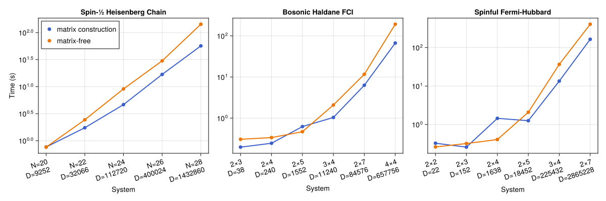

# RealSpace_ExactDiagonalization
**Symmetry-resolved exact diagonalization for hard-core bosons and fermions on arbitrary real-space graphs.**

A high-performance, statistics-agnostic Julia implementation following the design philosophy of [XDiag](https://github.com/awietek/xdiag). The package block-diagonalizes interacting quantum lattice Hamiltonians via bitmask encoding, orbit-stabilizer decomposition, and irrep-induced projection — without ever forming the full many-body matrix.

---

## Table of Contents

- [Design Innovations](#design-innovations)
- [Architecture](#architecture)
- [Theoretical Background](#theoretical-background)
- [Quick Start](#quick-start)
- [Examples](#examples)
- [Benchmarks](#benchmarks)
- [File Structure](#file-structure)
- [Dependencies](#dependencies)
- [References](#references)

---

## Design Innovations

1. **Bitmask encoding** — every Fock configuration $|n_1,\ldots,n_N\rangle$ (hard-core, $n_i\in\{0,1\}$) is a single `UInt` integer $m = \sum_i n_i 2^{i-1}$, enabling $O(1)$ bitwise operations via single-cycle CPU instructions (`popcount`, `ctz`, bitwise AND/OR/XOR).

2. **Orbit-stabilizer decomposition** — the many-body Hilbert space is partitioned into orbits under the symmetry group $G$. Each orbit is labelled by a canonical representative $|[\mathbf{s}]\rangle$ and its stabilizer subgroup data. Only representatives are stored, achieving the optimal $|G|$-fold compression.

3. **Irrep-induced projection** — 1D irreducible representations of finite abelian groups supply projectors $P_\chi$ that block-diagonalize the Hamiltonian without ever constructing the full matrix. An orbit contributes to irrep $\chi$ iff its stabilizer phases satisfy a compatibility condition.

4. **Two computational modes** — a *matrix mode* that precomputes sparse CSC matrices for fast Arpack diagonalization (memory-intensive but fast), and a *matrix-free mode* that computes $H|\psi\rangle$ on-the-fly via a multithreaded `CanonicalMap` cache (near-zero memory overhead, ~1.5–3× slower per sector).

5. **Unified boson/fermion treatment** — the entire pipeline is statistics-agnostic. Fermionic signs (permutation parity in symmetry actions and Jordan-Wigner strings in hopping) are injected via compile-time multiple dispatch on `Bosonic()` / `Fermionic()` singleton types, with zero runtime branching overhead.

---

## Architecture

```
                           ┌──────────────────────────────────────┐
                           │  ShortRange_Real_Space_              │
                           │  Second_Quantized_Model              │
                           │  · lattice geometry                  │
                           │  · bilinear terms  (a†_i a_j)        │
                           │  · density terms   (n_i n_j)         │
                           │  · statistics      (Bosonic/Fermionic)│
                           └──────────────┬───────────────────────┘
                                          │
              ┌───────────────────────────┼───────────────────────────┐
              │                           │                           │
    ┌─────────▼──────────┐    ┌───────────▼───────────┐    ┌──────────▼──────────┐
    │  Symmetry_Operation │    │  Gosper's Hack         │    │  Bitwise_Operations  │
    │  · perm:  π_g(i)    │    │  enumerate fixed-      │    │  · occupy/empty      │
    │  · phase: η_g(i)    │    │  weight bitmasks       │    │  · count_ones (popcnt)│
    │  · label g ∈ G      │    │  in lexicographic      │    │  · trailing_zeros     │
    └─────────┬──────────┘    │  order, O(1)/iter,     │    └─────────────────────┘
              │               │  zero allocation       │
              │               └───────────┬───────────┘
              │                           │
    ┌─────────▼──────────┐    ┌───────────▼───────────┐
    │  Finite_Symmetry_   │    │  Symmetry_Orbit_      │
    │  Group              │    │  Catalog              │
    │  · |G| ordered ops  │    │  · representative_mask │
    │  · identity index   │    │  · stabilizer orders   │
    └─────────┬──────────┘    │  · stabilizer phases    │
              │               └───────────┬───────────┘
              │                           │
              │               ┌───────────▼───────────┐
              │               │  OneDim_Irrep χ       │
              │               │  · label (e.g. k₁,k₂) │
              │               │  · χ(g₁), …, χ(g_|G|) │
              │               └───────────┬───────────┘
              │                           │
              │               ┌───────────▼───────────┐
              └───────────────┤  Symmetry_Sector_     │
                              │  Basis                │
                              │  · χ-compatible orbits │
                              │  · repr → index dict   │
                              └───────────┬───────────┘
                                          │
                         ┌────────────────┴────────────────┐
                         │                                 │
              ┌──────────▼──────────┐          ┌───────────▼──────────┐
              │  Matrix Mode         │          │  Matrix-Free Mode     │
              │                     │          │                      │
              │  build sparse CSC   │          │  CanonicalMap cache  │
              │    ↓                │          │    ↓                 │
              │  Arpack eigs        │          │  KrylovKit eigsolve  │
              │                     │          │                      │
              │  Memory: O(nnz)     │          │  Memory: O(dim)      │
              │  Speed:  1×         │          │  Speed:  ~1.5–3×     │
              │                     │          │  slower              │
              │  Parallel:          │          │  Parallel:           │
              │   pmap build        │          │   Threads.@threads   │
              │   BLAS multi-thread │          │   per-thread buffers │
              └─────────────────────┘          └──────────────────────┘
```

### Pipeline

1. **Define model** — construct the lattice (via `TightBinding`), add hopping and interaction terms with particle statistics.
2. **Build symmetry group** — generate `Symmetry_Operation`s (permutations + U(1) phases) and their 1D irreps.
3. **Enumerate configurations** — Gosper's hack iterates all bitmasks at fixed particle number in lexicographic order.
4. **Orbit-stabilizer decomposition** — partition bitmasks into $G$-orbits; record canonical representatives and stabilizer phases.
5. **Filter by irrep** — for a given character $\chi$, keep only orbits satisfying $\chi(h) = \alpha_h([\mathbf{s}])$ for all $h\in\mathrm{Stab}$.
6. **Build Hamiltonian block** — construct the sparse CSC matrix (matrix mode) or precompute the `CanonicalMap` (matrix-free mode).
7. **Diagonalize** — Arpack (CSC) or KrylovKit (matrix-free) to obtain eigenvalues and eigenvectors.
8. **Post-process** — analyse spectra, compute correlators, checkpoint and resume.

### Parallelism Strategy (HPC-ready)

```
BLAS threads:  1 (default) — don't compete with Julia workers
Build H:       Distributed.pmap across workers (matrix mode)
Diag:          BLAS.set_num_threads(nprocs()) temporarily for Arpack/KrylovKit
               … then restore BLAS = 1
Matvec H|ψ⟩:   Threads.@threads :static with per-thread accumulation buffers
GC:            explicit GC.gc(true) after each sector
Checkpoint:    JLD2 serialization of Symmetry_Resolved_ED_Data
```

---

## Theoretical Background

### Bitmask Encoding

With the hard-core constraint $n_i \in \{0,1\}$, each configuration is a binary string of length $N$:

$$\boxed{|\mathbf{s}\rangle \equiv |n_1,\ldots,n_N\rangle \;\longmapsto\; m = \sum_{i=1}^N n_i\,2^{\,i-1} \;\in\; \{0,1,\ldots,2^N-1\}}$$

Bit $i-1$ (0-based) corresponds to vertex $i$ (1-based). Key advantages:
- Occupancy test, creation, annihilation — all $O(1)$ bitwise operations.
- Lexicographic total order via integer comparison — natural for orbit representatives.
- `count_ones` (POPCNT), `trailing_zeros` (TZCNT), `&`, `|`, `^` — all single-cycle CPU instructions.

### Symmetry Action

For a finite group $G$ with unitary representation $U_g$ commuting with $H$:

$$U_g\,a_i^\dagger\,U_g^{-1} = \eta_g(i)\,a_{\pi_g(i)}^\dagger$$

On a bitmask $m$:

$$U_g|m\rangle = \alpha_g(m)\,|m'\rangle,\qquad m' = \sum_{i\in\mathrm{occ}(m)} 2^{\pi_g(i)-1},\qquad \alpha_g(m) = \prod_{i\in\mathrm{occ}(m)}\eta_g(i)$$

Fermionic statistics add a permutation parity factor: $\mathrm{sgn}(\pi_g|_{\mathrm{occ}(m)})$ computed inline via `count_ones(new_mask >> (π_g(i)-1))` during the bit-loop.

### Orbit-Stabilizer Theorem

$$|\mathrm{Orb}(\mathbf{s})| = \frac{|G|}{|\mathrm{Stab}(\mathbf{s})|}$$

The canonical representative is the smallest bitmask in the orbit (lexicographic gauge). Knowing only the $N_\text{orbits}$ representatives and their stabilizer data suffices to reconstruct the full Hilbert space, with compression ratio $\approx N_\text{orbits}/\binom{N}{N_e} \approx 1/|G|$.

### Irrep Projector and Compatibility

For a 1D irrep $\chi$ of a finite abelian group:

$$P_\chi = \frac{1}{|G|}\sum_{g\in G} \chi(g)^*\,U_g,\qquad P_\chi^2 = P_\chi,\qquad [P_\chi, H] = 0$$

An orbit representative $|[\mathbf{s}]\rangle$ contributes to sector $\chi$ iff:

$$\boxed{\chi(h) = \alpha_h([\mathbf{s}])\;\;\forall h\in\mathrm{Stab}(\mathbf{s})}$$

When compatible, the orthonormal projected basis state is:

$$|\widetilde{[\mathbf{s}];\chi}\rangle = \sqrt{\frac{|\mathrm{Stab}(\mathbf{s})|}{|G|}}\sum_{g\in G/\mathrm{Stab}(\mathbf{s})} \chi(g)^*\,U_g|[\mathbf{s}]\rangle$$

### Hamiltonian Matrix Elements

For a scattered configuration $|\mathbf{m}\rangle = H|[\mathbf{s}]\rangle$, projected back to the sector:

$$H_{\mathbf{s}',\mathbf{s}}^\chi = \mathsf{coeff}\cdot\sqrt{\frac{|\mathrm{Stab}(\mathbf{m})|}{|\mathrm{Stab}(\mathbf{s})|}}\;\delta_{[\mathbf{s}'],[\mathbf{m}]}$$

where $\mathsf{coeff} = \alpha_{g_{\mathbf{m}}}\,\chi(g_{\mathbf{m}})^*$ and $g_{\mathbf{m}}$ maps $|\mathbf{m}\rangle$ to its canonical representative.

### Jordan-Wigner String (Fermions)

The hopping sign for fermions depends only on occupied sites strictly between $i$ and $j$:

$$c_j^\dagger c_i\,|\mathbf{s}\rangle = (-1)^{\sum_{k=\min(i,j)+1}^{\max(i,j)-1} n_k}\;|\mathbf{s}; i \to j\rangle$$

Computed in $O(1)$ via `count_ones(m & between_mask)`.

---

## Quick Start

```julia
using RealSpace_ExactDiagonalization
using TightBinding

# ── Build the Haldane honeycomb model (2×3 unit cells, 3 hard-core bosons) ──
tb_model = build_bose_hubbard_real_space_tb_model(; sample_size=[2, 3], params=params)
model = initialize_second_quantized_model_for_Haldane_honeycomb_lattice(
    tb_model; params, statistics=Bosonic()
)

# ── Translation symmetry: |G| = 6 ──
symmetry = build_translation_group(model.lattice)

# ── Build ED data at ν = 1/2 per band ──
ed_data = build_ed_data(model; filling_fraction=3//12, symmetry=symmetry)

# ── Scan all momentum sectors (matrix-free, 8 threads) ──
ed_scan!(ed_data; nev=5, mode=:matrixfree)

# ── Inspect ──
print_spectrum(ed_data)
fig, ax = plot_spectrum(ed_data)
save("spectrum.svg", fig)
```

### Checkpoint-Resume (HPC-safe)

```julia
# Run with checkpoint — survives preemption
ed_scan!(ed_data; mode=:matrixfree, checkpoint_path="checkpoints/run1.jls")

# Resume — already-computed sectors are automatically skipped
ed_data = load_checkpoint("checkpoints/run1.jls")
ed_scan!(ed_data; mode=:matrixfree, checkpoint_path="checkpoints/run1.jls")
```

---

## Examples

Three self-contained, pedagogical example scripts in `examples/`. Each builds a lattice via `TightBinding`, constructs the second-quantized model, sets up translation symmetry, and runs symmetry-resolved ED.

### 1. Spin-½ Heisenberg Chain — `examples/spin_heisenberg_chain.jl`

$$H = J\sum_{\langle i,j\rangle} \mathbf{S}_i\cdot\mathbf{S}_j \qquad (\text{1D chain, PBC, } J>0)$$

Mapped to hard-core bosons via the **Matsubara-Matsuda** transformation:

$$S^z_i = n_i - \tfrac12,\qquad S^+_i = b^\dagger_i,\qquad S^-_i = b_i$$

$$\mathbf{S}_i\cdot\mathbf{S}_j = n_i n_j + \tfrac12(b^\dagger_i b_j + \mathrm{h.c.}) - \tfrac12 n_i - \tfrac12 n_j + \tfrac14$$

At half-filling ($N_e=N/2$), constant contributions sum to $-JN/4$ and are absorbed by on-site density terms $(i,i,-J/2)$. Translation symmetry $\mathbb Z^N$ gives $N$ momentum sectors.

```bash
julia --project=. examples/spin_heisenberg_chain.jl
```

**Benchmark:** $E_0/N = -\ln 2 + 1/4 \approx -0.443147$ (Bethe ansatz, thermodynamic limit).

### 2. Bosonic Fractional Chern Insulator — `examples/boson_fci_haldane.jl`

$$H = \sum_{\langle i,j\rangle} t_{ij}\,b^\dagger_i b_j + \sum_{\langle\langle i,j\rangle\rangle} t'_{ij}\,b^\dagger_i b_j + \sum_{\langle\langle\langle i,j\rangle\rangle\rangle} t''_{ij}\,b^\dagger_i b_j$$

Haldane honeycomb lattice, 2×3 unit cells (12 sites), 3 hard-core bosons at $\nu=1/2$ per band. Complex next-nearest-neighbour hoppings $t' = -0.60\,e^{\pm i\phi}$ ($\phi=0.4\pi$) break time-reversal symmetry. Parameters from D.N. Sheng et al., PRL **107**, 146803 (2011).

```bash
julia --project=. examples/boson_fci_haldane.jl
```

**Expected:** Two nearly degenerate ground states at $E \approx -7.1638$ (k=(0,0)) and $E \approx -7.1634$ (k=(1,0)), topological splitting $\Delta E \approx 4.3\times10^{-4}$.

### 3. Spinful Fermi-Hubbard Model — `examples/fermion_hubbard_square.jl`

$$H = -t\sum_{\langle i,j\rangle,\sigma} \big(c^\dagger_{i\sigma} c_{j\sigma} + \text{h.c.}\big) + U\sum_i n_{i\uparrow} n_{i\downarrow}$$

Spin degrees of freedom are handled by the **flattened-graph approach**: each spatial site $i$ generates two interleaved graph vertices — $i_\uparrow$ (vertex $2i-1$) and $i_\downarrow$ (vertex $2i$). This preserves correct fermionic anticommutation via the Jordan-Wigner string, with no modification to the `Symmetry_Operation` infrastructure.

2×3 spatial unit cells → 12 graph vertices, $N_\uparrow=N_\downarrow=3$ ($N_e=6$), $t=1$, $U=8$. Translation group $\mathbb Z^2\times\mathbb Z^3$.

```bash
julia --project=. examples/fermion_hubbard_square.jl
```

---

## Benchmarks

### Comprehensive Multi-Model Benchmark

```bash
julia --project=. -p 96 -t 96 benchmark/benchmark.jl    # run all models
julia --project=. benchmark/plot_benchmark.jl            # plot from CSV
```

Timing **one symmetry sector** per model and system size (after JIT warmup):

| Model | System Sizes | Symmetry Group | Max Vertices |
|-------|-------------|----------------|-------------|
| Spin-½ Heisenberg chain | $N = 20, 22, 24, 26, 28$ | $\mathbb Z^N$ | 28 |
| Bosonic Haldane FCI | $[2,3], [2,4], [2,5], [3,4], [2,7]$ | $\mathbb{Z}^{L_1}\times\mathbb{Z}^{L_2}$ | 28 |
| Spinful Fermi-Hubbard | $[2,3], [2,4], [2,5], [3,4], [2,7]$ | $\mathbb{Z}^{L_1}\times\mathbb{Z}^{L_2}$ | 28 |

- $N=28$ Heisenberg: full Hilbert space $2^{28} = 2.68\times10^8$, reduced to $\sim9.6\times10^6$ per sector.
- $[2,7]$ Hubbard: $\binom{28}{14} = 4.01\times10^7$, reduced to $\sim2.9\times10^6$ per sector.

Generated figures (in `benchmark/figures/`): system-size plots, log-log scaling plots, and a combined summary.



---

## Tests

```bash
julia --project=. test/runtests.jl
```

| Test | Target |
|------|--------|
| Haldane hard-core bosons, 2×3, 3 particles | FCI pair: $-7.16380536$, $-7.16337536$ |
| Matrix vs matrix-free, same system | Spectra agree to numerical precision |
| Spinless fermion open chain | Many-body energy = sum of filled single-particle levels |
| Spinful Hubbard, 3×4 open square, $U=8$, $N_\uparrow=N_\downarrow=6$ | $E_0 = -4.913259209075605$ |

The Hubbard reference is from [ExactDiagonalization.jl documentation](https://quantum-many-body.github.io/ExactDiagonalization.jl/dev/examples/HubbardModel/).

---

## File Structure

```
RealSpace_ExactDiagonalization/
├── examples/
│   ├── spin_heisenberg_chain.jl          Spin-½ Heisenberg chain (N=20)
│   ├── boson_fci_haldane.jl              Bosonic FCI on Haldane honeycomb
│   └── fermion_hubbard_square.jl         Spinful Fermi-Hubbard on square lattice
├── src/
│   ├── RealSpace_ExactDiagonalization.jl  Main module
│   ├── bitwise_operations.jl              Bitmask primitives (submodule)
│   ├── second_quantized_model.jl          Model data structures
│   ├── symmetry_resolved_ed.jl            Core ED engine
│   └── test.jl                            Model builders & test utilities
├── doc/
│   └── design.ipynb                       Complete design documentation (theory & code)
├── benchmark/
│   ├── benchmark.jl                       Comprehensive multi-model benchmark
│   ├── plot_benchmark.jl                  Plotting from CSV results
│   ├── xdiag_compare.jl                   XDiag comparison benchmark
│   ├── results/                           Generated CSV timing files
│   └── figures/                           Generated CairoMakie SVG plots
├── test/
│   └── runtests.jl                        Sanity checks
├── Project.toml
└── README.md
```

---

## Dependencies

- **Julia** ≥ 1.10
- [`TightBinding`](https://github.com/GrothendieckUniverse/TightBinding) — real-space lattice and tight-binding model construction
- `Arpack` — sparse eigensolver (matrix mode)
- `KrylovKit` — iterative eigensolver (matrix-free mode)
- `MLStyle` — algebraic data types for `Bosonic()` / `Fermionic()` dispatch
- `SparseArrays`, `LinearAlgebra`, `Distributed` — standard library
- `CairoMakie` — plotting
- `JLD2` — checkpoint serialization

---

## References

- A. Wietek, *XDiag* — [github.com/awietek/xdiag](https://github.com/awietek/xdiag); arXiv:2505.02901
- D.N. Sheng, Z.-C. Gu, K. Sun, L. Sheng, *Fractional Chern Insulator in a Bosonic Model with Flat Bands*, Phys. Rev. Lett. **107**, 146803 (2011)
- R. Gosper, *HAKMEM* Item 175 (Gosper's hack)
- Full design documentation: `doc/design.ipynb`